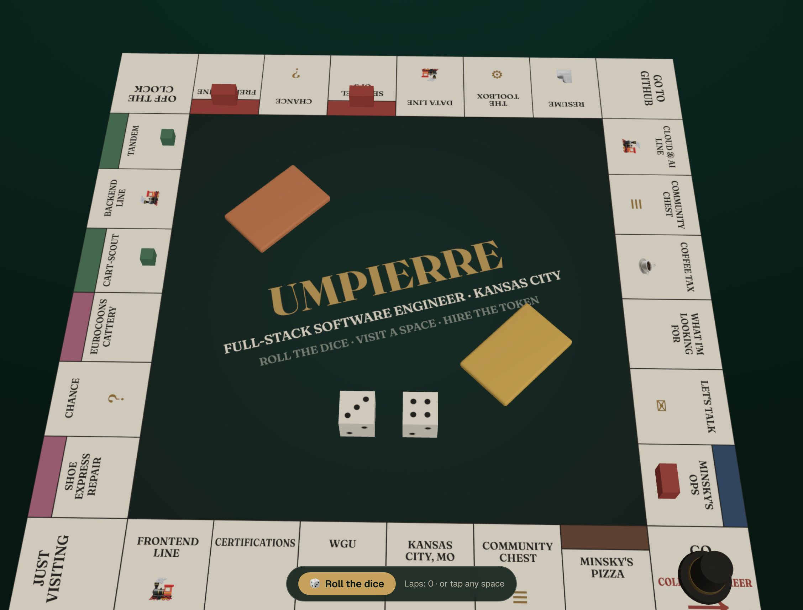

# Portfolio — Jordan Umpierre

Personal portfolio, themed as a board-game homage: every section of the site is
a space on a 28-space board defined in a single content registry — and the
board is real. A procedurally built 3D board (zero glTF assets) mounts above
the classic content on capable devices: roll the dice, watch the top-hat token
hop space to space, and the space you land on opens its panel.



## Stack

Next.js 16 (App Router, fully static output) · React 19 · TypeScript ·
Tailwind CSS 4 · Playwright · Vercel

## Architecture notes

- **Content registry as single source of truth** — `src/content/board.ts`
  defines all 28 board spaces as a discriminated union;
  `src/content/projects.ts` holds the project case studies. The classic
  sections, `/project/[slug]` pages, OG images, and (later) the 3D board all
  render from the same registry.
- **Static-first, crawler-safe** — every route is prerendered
  (`force-static` / `generateStaticParams`). Scroll reveals are additive: CSS
  keeps all content visible for no-JS, reduced-motion, and crawler visitors,
  enforced by a Playwright test that browses with JavaScript disabled.
- **SEO plumbing** — per-project `generateMetadata`, generated
  title-deed-style OG images (`opengraph-image.tsx`), JSON-LD (`Person` +
  `SoftwareSourceCode`), `sitemap.ts`, `robots.ts`.
- **The 3D board is a guest, not the host** — `src/components/board3d/` is a
  lazy client island loaded on `requestIdleCallback` (or the poster's "Enter
  the Board" button), dynamic-imported so `three` never touches the initial
  JS. A capability gate (WebGL2, `prefers-reduced-motion`, device
  memory/cores) and a persisted "Recruiter mode" toggle both fall back to the
  identical static content. Everything in the scene is procedural: the board
  face is one 2048px Canvas2D texture, the dice tumble is choreographed onto
  deterministic face quaternions, the token is a lathed top hat, and the whole
  scene renders on a demand frameloop — zero idle GPU work. Keyboard path:
  arrows browse a roving-tabindex listbox of all 28 spaces, Enter travels,
  R rolls, Esc closes; a live region announces rolls and landings.

## Develop

```sh
pnpm install
pnpm dev              # local dev
pnpm validate-content # registry invariants (28 spaces, corners, link resolution)
pnpm typecheck && pnpm lint
pnpm build && pnpm test:e2e
```

Set `NEXT_PUBLIC_SITE_URL` in production for canonical URLs/sitemap.
